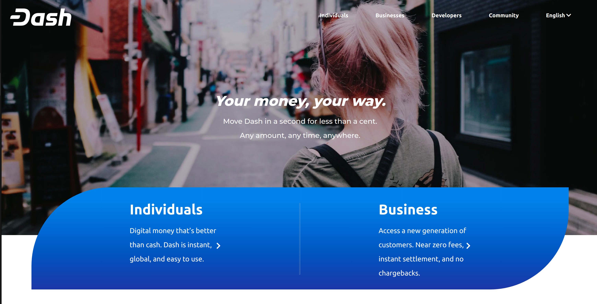

# Our framework project

In this project We've cloned the **[DASH](https://www.dash.org/)** webpage using our own framework.



---
_We have recreated the basic structure of the page without any ads and interactive elements._
---

## Live version

* https://mesi21.github.io/Own-Grid-Based-Framework/

## Contribution guide

1. Clone the project
```bash
  git clone (https://github.com/Mesi21/Own-Grid-Based-Framework.git)
  cd Own-Grid-Based-Framework
```

2. Then :heavy_plus_sign: add your contribution
3. And Feel free to make a PR

## Tehnical tools:

- HTML & CSS
- Own Grid-based Framework
- SASS

## Contributors:

- [Molnar Emese](https://github.com/Mesi21) :
  
  - [Email:](mailto:mse212002@gmail.com) - mse212002@gmail.com
  - [Portfolio]()
  - [LinkedIn](https://www.linkedin.com/in/emesemesimolnar/).  
  - [Twitter](https://twitter.com/buksimesi21) 
  - [Angel List]()
  
- [Rodolfo Jose Llinas](https://github.com/RadiactiveJesus)

### If you like this project don't forgot to support us by giving a :star: 
